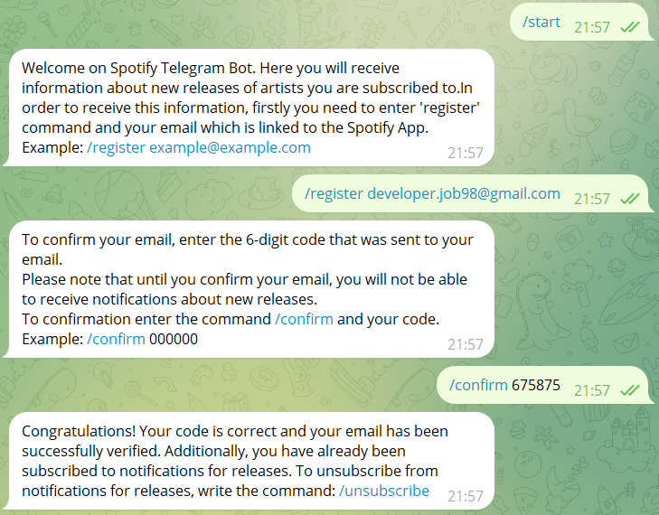

# Spotify Telegram Notification Bot

## Overview
This bot sends notifications about new releases from artists the user follows on Spotify.
Every day at 9 AM, the bot fetches new releases from RabbitMQ and
sends notifications to users who have registered and confirmed their email.

## How to Start the Bot

To start the bot, simply type the `/start` command and follow the instructions provided. 
Below is an example of what you will see:

## Links to path of project:
- Spotify Service API Back-end: https://github.com/monoskribt/spotify-service-backend
- Spotify Service API Front-en: https://github.com/monoskribt/spotify-service-frontend
- Spotify Service API Telegram Bot: Currently you are here.
